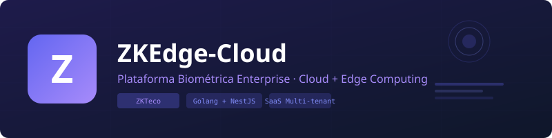

<p align="center">
  
</p>

<p align="center">
  <strong>Plataforma Biométrica Enterprise · Cloud + Edge Computing</strong>
</p>

<p align="center">
  
  
  
  
  
  
</p>

---

## Arquitectura

```
┌─────────────────────────────────────────────────────────────┐
│                   SUCURSAL (EDGE NODE)                       │
│  ┌──────────┐     ┌──────────────────────────────────────┐  │
│  │ ZKTeco   │◄───►│  Edge Agent (Golang)                 │  │
│  │ Device   │ TCP │  ┌──────────┐  ┌──────────────────┐  │  │
│  └──────────┘     │  │ SQLite   │  │ Health Dashboard │  │  │
│  ┌──────────┐     │  │ Buffer   │  │ :8081            │  │  │
│  │ ZKTeco   │◄───►│  │ Queue    │  └──────────────────┘  │  │
│  │ Device   │ TCP │  │ DLQ      │                         │  │
│  └──────────┘     │  └──────────┘  MQTT/HTTPS (TLS)       │  │
│                   └──────────────────┬─────────────────────┘  │
│                                      │                        │
└──────────────────────────────────────┼────────────────────────┘
                                       │
┌──────────────────────────────────────┼────────────────────────┐
│                              CLOUD   │                        │
│  ┌───────────────────────────────────▼─────────────────────┐  │
│  │  NestJS API (REST + WebSocket + MQTT)                  │  │
│  │  PostgreSQL · Redis · Multi-tenant SaaS                │  │
│  └───────────────────────────────────┬─────────────────────┘  │
│                                      │                        │
│  ┌───────────────────────────────────▼─────────────────────┐  │
│  │  Next.js Dashboard (SSR + PWA + Tiempo Real)           │  │
│  └─────────────────────────────────────────────────────────┘  │
└────────────────────────────────────────────────────────────────┘
```

## Stack Tecnológico

| Capa | Tecnología | Propósito |
|------|-----------|-----------|
| **Edge** | Go 1.22, SQLite, MQTT | Agente local, buffer offline, health dashboard |
| **Backend** | NestJS, TypeScript | API REST, WebSocket, reglas de negocio |
| **DB** | PostgreSQL 16 | Datos multi-tenant, histórico permanente |
| **Cache** | Redis 7 | Sesiones, rate limiting, pub/sub |
| **Frontend** | Next.js 14, React, Tailwind | Dashboard SaaS enterprise con PWA |
| **Tiempo Real** | Socket.IO, MQTT | Eventos en vivo, notificaciones push |
| **Infra** | Docker, Docker Compose | Contenedores, CI/CD |

## Features

### 🔹 Edge Computing (Agente Local)
- [x] Comunicación TCP/IP con ZKTeco (puerto 4370)
- [x] Descubrimiento automático de dispositivos en LAN
- [x] Device Identity basado en serial (no IP)
- [x] CommKey cifrado (AES-256-GCM)
- [x] SQLite local con WAL mode
- [x] Cola offline + Dead Letter Queue
- [x] Incremental sync con cursor tracking
- [x] Exponential backoff + Circuit Breaker
- [x] Heartbeat cada 30s al cloud
- [x] Auto-update del agente
- [x] Dashboard local técnico (`:8081`)
- [x] Health check endpoint (`/api/health`)
- [x] Comandos remotos vía MQTT

### 🔹 Cloud SaaS (Backend + Frontend)
- [x] Multi-tenant (empresas, sucursales)
- [x] Autenticación JWT + Refresh Tokens + 2FA
- [x] RBAC (Super Admin, Admin, Gerente, Visor)
- [x] CRUD completo de empleados con contratos
- [x] Gestión de dispositivos biométricos
- [x] Motor de horarios con feriados y turnos
- [x] Detección automática de retrasos y faltas
- [x] Módulo de Payroll (planillas + descuentos)
- [x] Workflow RRHH (vacaciones, permisos, aprobaciones)
- [x] HR Analytics (KPIs, heatmaps, tendencias)
- [x] Reportes exportables (Excel/PDF)
- [x] Auditoría completa de operaciones
- [x] Tiempo real con WebSocket
- [x] PWA (Progressive Web App)
- [x] Dark mode
- [x] Búsqueda global (Ctrl+K)

## Inicio Rápido

### Requisitos
- Docker & Docker Compose
- Node.js 20+
- Go 1.22+ (solo para compilar el agente)

### 1. Infraestructura
```bash
docker compose -f docker/docker-compose.yml up -d
```

### 2. Backend
```bash
cd backend && npm install && npm run start:dev
```

### 3. Frontend
```bash
cd frontend && npm install && npm run dev
```

### 4. Edge Agent
```bash
cd agent && go build -o agente.exe ./cmd/agent && ./agente.exe
```

### Acceso
| Servicio | URL |
|----------|-----|
| Frontend SaaS | http://localhost:3000 |
| API Backend | http://localhost:3001 |
| API Docs (Swagger) | http://localhost:3001/api/docs |
| Edge Dashboard | http://localhost:8081 |

### Credenciales Demo
```
Email: admin@sistema.com
Password: 123456
```

## Estructura del Proyecto

```
├── agent/                      # Edge Agent (Go)
│   ├── cmd/agent/main.go       # Entry point
│   ├── internal/
│   │   ├── config/             # Configuración YAML
│   │   ├── device/             # Device manager + identity
│   │   ├── edge/               # Edge node + retry policy
│   │   ├── health/             # Dashboard local + health API
│   │   ├── service/            # Windows service wrapper
│   │   ├── store/              # SQLite (buffer, queue, DLQ)
│   │   ├── sync/               # Cloud sync (MQTT + HTTP)
│   │   ├── update/             # Auto-updater
│   │   └── zkteco/             # Protocolo TCP/IP ZKTeco
│   └── pkg/queue/              # Offline queue
│
├── backend/                    # NestJS Cloud API
│   └── src/modules/
│       ├── auth/               # JWT, 2FA, RBAC
│       ├── companies/          # Multi-tenant
│       ├── branches/           # Sucursales
│       ├── devices/            # Dispositivos
│       ├── employees/          # Empleados + contratos
│       ├── attendance/         # Marcaciones + reglas
│       ├── schedules/          # Horarios + feriados
│       ├── payroll/            # Planillas + descuentos
│       ├── workflow/           # Vacaciones, permisos
│       ├── hr-analytics/       # KPIs, heatmaps
│       ├── reports/            # Reportes
│       ├── edge/               # Edge node management
│       ├── realtime/           # WebSocket gateway
│       └── audit/              # Auditoría
│
├── frontend/                   # Next.js SaaS Dashboard
│   ├── src/app/(auth)/         # Login, 2FA
│   ├── src/app/(dashboard)/    # Dashboard, Devices, Employees...
│   ├── src/components/ui/      # UI components (Shadcn-like)
│   ├── src/components/charts/  # Recharts
│   └── src/lib/                # API client, Socket.IO
│
├── docker/                     # Docker Compose + Dockerfiles
└── docs/                       # Documentación técnica
```

## Documentación

- [Arquitectura](docs/architecture.md)
- [Base de Datos](docs/database.md)
- [Comunicación ZKTeco](docs/communication.md)
- [Edge Computing](docs/edge-computing.md)
- [Despliegue](docs/deployment.md)

## Licencia

MIT © 2026 ZKEdge-Cloud
